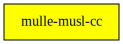

# mulle-musl-cc

🐚 Add -static flag to musl-gcc (and clang)

When you configure musl with `-disable-shared`, there is no `libc.so` to link.
So you must compile or rather link with `-static`. And not adding `-static`
doesn't make sense. The musl C compiler **musl-gcc**, which is basically just
a wrapper around *gcc* doesn't set that by default.

This little script rectifies the situation. It checks, if the shared library
libc ios available, and if not, forces the `-static` flag.

Install where `musl-gcc` resides and use with `CC=gcc.musl`.

For *cmake* you also need to define `CMAKE_SKIP_RPATH`. This is helpfully done
in the `definition` provided and installed by mulle-musl-cc.

To reap the fruits of this definition, set SDKs to "musl" with
`mulle-sde env --global set SDKS musl`,


** DOES NOT WORK ON MacOS or Windows **

All compilers define `__MULLE_MUSL__` and define `__MULLE_STATICALLY_LINKED__`,
if appropriate.


## mulle-clang support

There is also `clang.musl` and `mulle-clang.musl`. These files attempt to
do what `musl-gcc` does, but for the clang compiler. But they always force
static compilation and linking, whereas `gcc.musl` will also work with
shared library musl.


## Add mulle-musl-cc to your mulle-sde project

``` sh
mulle-sde add --marks no-header,no-link --github mulle-cc mulle-musl-cc
```


> #### Note
>
> This project does not build the mulle-musl library.
> See [mulle-musl](//github.com/mulle-cc/mulle-musl) for that.
>


### You are here



